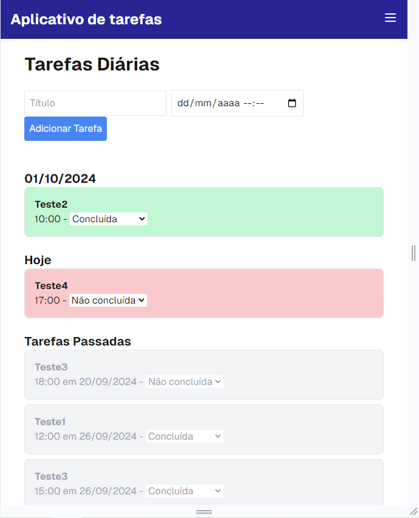
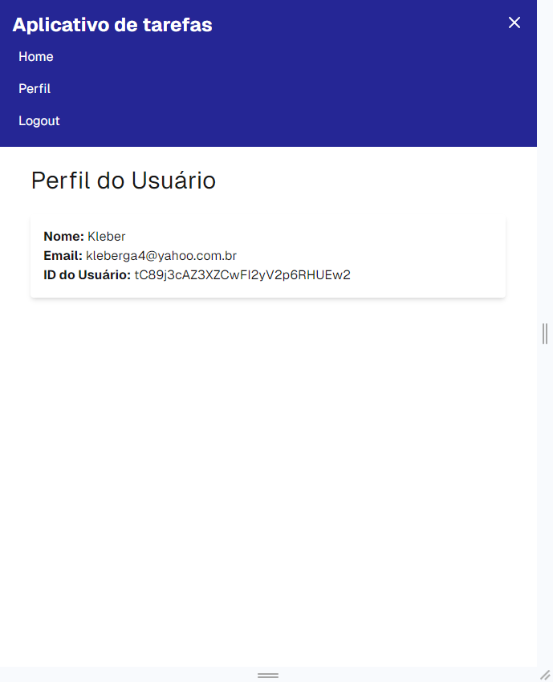

## Progressive Web App (PWA) para gestão de tarefas diárias

O aplicativo utiliza o conceito de PWA e tem como objetivo gerenciar as tarefas diárias do usuário. Para tanto, o aplicativo possui as seguintes funcionalidades:
- tela de registro (solicitando nome, e-mail e senha) e tela de login;
- o usuário registra a tarefa, a data e o horário da tarefa;
- a tarefa é criada automaticamente como "Não concluída" e aparece com cor vermelha na tela Home. Quando o usuário concluir a tarefa, existe um botão para ele marcar a tarefa como Concluída e ela passa para a cor verde;
- as tarefas ficam agrupadas nos blocos de tarefas de hoje, tarefas para dias futuros e tarefas passadas;
- o usuário pode inserir tarefas mesmo quando não está conectado na internet, pois quando a conexão retornar, as tarefas são enviadas ao servidor na internet;
- na barra do aplicativo, consta um menu com opções de acessar a tela de perfil, efetuar logout ou retornar para a Home; e
- na tela de perfil, é possível ver o nome, e-mail e código de usuário.

Do ponto de vista técnico, o aplicativo possui as seguintes características:
- foi criado utilizando o framework Next.JS do React;
- o aplicativo possui manifesto e pode ser instalado no computador;
- existe um banco de dados local indexado ao navegador, para salvar as tarefas quando não houver conexão com a internet;
- o sistema de login é realizado pelo Google Firebase; e
- o armazenamento do nome do usuário e das tarefas na internet é feito no banco de dados Firestore do Google Firebase.

A seguir são apresentadas as telas do aplicativo.

1. Tela de Registro:

2. Tela de Login:

3. Tela Home:

4. Tela Menu:

5. Tela Perfil:

